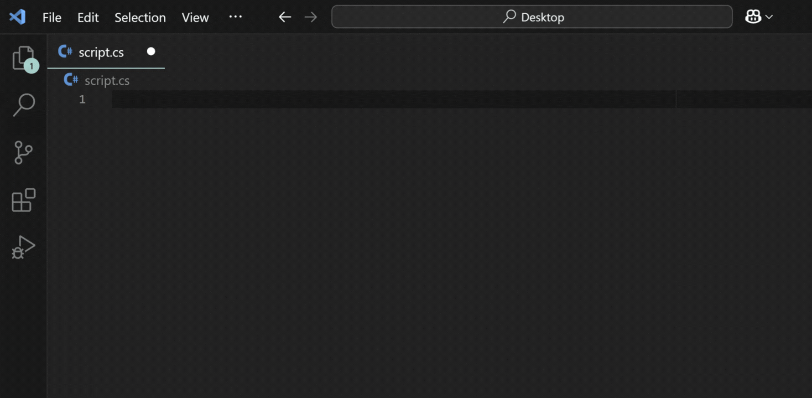

Drop-in P/Invoke templates, fast.

**How to Use**

1. `Ctrl + Shift + P`
2. `> P/Invoke`
3. Type something like `CreateProcess`
4. Paste with `Ctrl + V`

**Supported Languages**

* C
* C++
* C#
* VB(A)

**Highlights**

* Auto-detects your language
* Native types assumed (e.g., structs = `void*`)
* Templates built dynamically from MSDN-style declarations
